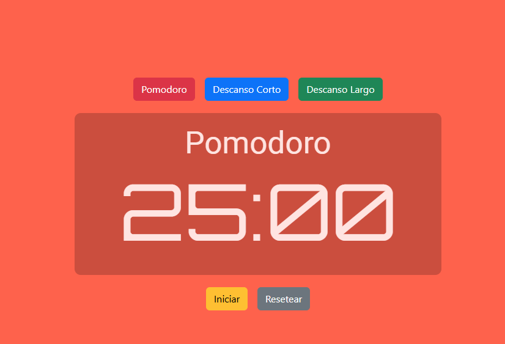

# Timer Pomodoro

## Descripción

¡Hola a tu Pomodoro! Esta aplicación está creada para asistirte en la administración eficaz de tu tiempo mediante el método Pomodoro. Con una interfaz atractiva e intuitiva, puedes enfocarte en tus labores y disfrutar de breves pausas para potenciar tu rendimiento.

## Especificaciones

- **Temporizador Pomodoro**: Inicia tu sesión laboral con un cronómetro de 25 minutos y enfócate en tus responsabilidades.
- **Descansos Cortos y Largos**: Cambia entre 5 y 15 minutos de descanso para conservar tu energía.
- **Alertas**: Obtén notificaciones cuando te queda escaso tiempo en tu sesión de Pomodoro o durante los periodos de descanso.
- **Diseño Responsivo**: Garantiza que tu experiencia sea sin contratiempos en cualquier dispositivo.

## Tecnologías Empleadas

- **React** utilizando **Vite**: Para una experiencia de desarrollo ágil.
- **Bootstrap**: Para un diseño atractivo y responsivo.
- **Jest**: Para realizar pruebas y asegurar el correcto funcionamiento de la aplicación.
